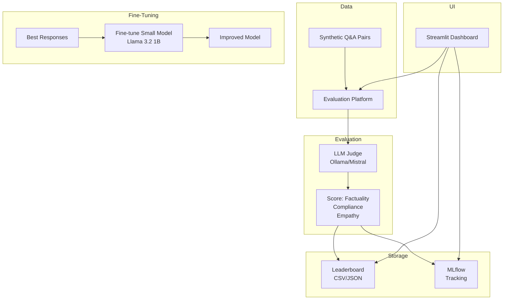

# LLM Evaluation Platform

A platform that evaluates multiple LLM responses using an LLM-as-a-judge, tracks results with MLflow, and maintains a leaderboard.

## Table of Contents
- [Overview](#overview)
- [Architecture](#architecture)
- [Features](#features)
- [Tech Stack](#tech-stack)
- [Prerequisites](#prerequisites)
- [Setup & Installation](#setup--installation)
- [Running the Platform](#running-the-platform)
- [API Endpoints](#api-endpoints)
- [Using the UI](#using-the-ui)
- [Fine-Tuning](#fine-tuning)
- [Evaluation Metrics](#evaluation-metrics)
- [Troubleshooting](#troubleshooting)

---

## Overview

This project demonstrates an **LLM evaluation system** where a judge LLM scores candidate responses on multiple dimensions. It is designed to help compare different models or prompts and automatically track improvements over time.

**Key aspects**:
- **LLM-as-a-Judge**: Use an LLM (e.g., Mistral 7B) to score responses on factuality, compliance, and empathy.
- **Leaderboard**: Store scores for different models/prompts.
- **MLflow Integration**: Track evaluation runs, parameters, and metrics.
- **Fine-Tuning**: Example script to fine-tune a small model (Llama 3.2 1B) on the best responses.

---

## Architecture



---

## Features

- **Synthetic Data Generation**: Create Q&A pairs using an LLM.
- **Judge LLM**: Scores each candidate response on a scale of 1-5 for three metrics.
- **Leaderboard**: View best performing models/prompts.
- **MLflow Tracking**: Compare runs with parameters and metrics.
- **Fine-Tuning**: Optional script to fine-tune a smaller model using the best responses.

---

## Tech Stack

| Component          | Technology                          |
|--------------------|-------------------------------------|
| **Backend**        | Python + FastAPI                    |
| **Judge LLM**      | Ollama (Mistral / Llama 3.2)        |
| **Candidate LLMs** | Ollama (any models you want)        |
| **Tracking**       | MLflow                              |
| **Leaderboard**    | JSON file / SQLite (optional)       |
| **UI**             | Streamlit                           |
| **Fine-Tuning**    | Hugging Face Transformers + PEFT    |

---

## Prerequisites

- Python 3.10+
- Docker and Docker Compose (optional, for MLflow)
- Ollama installed and running ([ollama.com](https://ollama.com))
- (For fine-tuning) GPU recommended but not required for small models

---

## Setup & Installation

### 1. Clone the Repository
```bash
git clone https://github.com/your-username/llm-evaluation-platform.git
cd llm-evaluation-platform
```

### 2. Create Virtual Environment
```bash
python -m venv venv
source venv/bin/activate  # On Windows: venv\Scripts\activate
```

### 3. Install Dependencies
```bash
pip install -r requirements.txt
```

### 4. Start MLflow (optional)
```bash
mlflow server --host 0.0.0.0 --port 5000
```

### 5. Configure Environment
Copy `.env.example` to `.env` and adjust if needed.

### 6. Pull Required Ollama Models
```bash
ollama pull mistral        # judge model
ollama pull llama3.2       # candidate model (or any other)
ollama pull llama3.2:1b    # for fine-tuning base
```

### 7. Generate Synthetic Q&A
```bash
python scripts/generate_samples.py
```

### 8. Run Evaluation
```bash
python src/evaluator.py --candidates llama3.2 mistral --judge mistral
```

### 9. Start API
```bash
uvicorn src.api:app --reload --port 8000
```

### 10. Launch UI
```bash
streamlit run app.py
```

---

## API Endpoints

### `POST /evaluate`
Submit a question and get scores from candidate models (or evaluate a batch).

### `GET /leaderboard`
Retrieve the current leaderboard.

### `POST /submit_evaluation`
Add a new evaluation result (used by the evaluation script).

---

## Using the UI

The Streamlit dashboard allows you to:
- View the leaderboard sorted by average score.
- Run a new evaluation on a question with selected candidate models.
- Visualize MLflow runs.

---

## Fine-Tuning

The `src/fine_tune.py` script demonstrates how to fine-tune a small model (Llama 3.2 1B) on the best responses from the leaderboard. It uses LoRA (PEFT) to keep memory usage low.

To run:
```bash
python src/fine_tune.py --data data/best_responses.json
```

The fine-tuned model will be saved in `output/`.

---

## Evaluation Metrics

The judge LLM is prompted to score each candidate response on three dimensions (each 1-5):

- **Factuality**: How accurate is the response based on given context? (1 = completely false, 5 = fully correct)
- **Compliance**: Does the response adhere to the user's instructions? (1 = completely off, 5 = perfectly aligned)
- **Empathy**: Does the response show appropriate tone and understanding? (1 = robotic/offensive, 5 = empathetic and helpful)

The overall score is the average of the three.

---

## Troubleshooting

| Problem | Solution |
|---------|----------|
| Judge LLM not responding | Ensure Ollama is running and the model is pulled. |
| MLflow connection refused | Check the MLflow server is running on the correct port. |
| Fine-tuning out of memory | Reduce batch size or use a smaller base model. |

---

## Next Steps

- Add more metrics (e.g., conciseness, creativity).
- Automate evaluation on a schedule.
- Integrate with CI/CD to compare new model versions.

## License
MIT